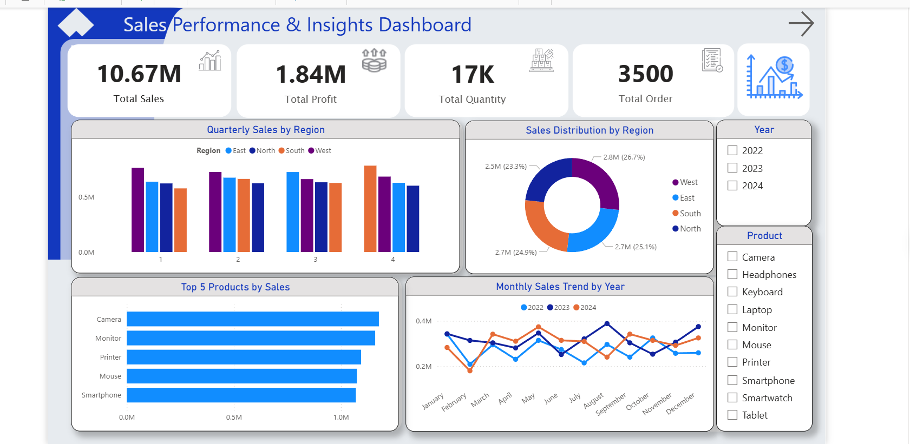
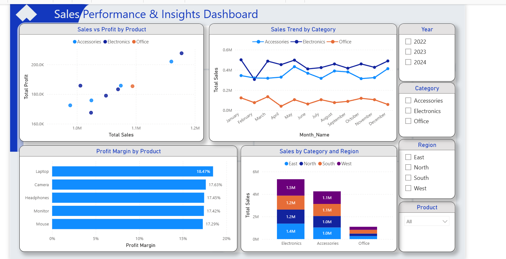

# sales-insights-dashboard
Sales analysis project using Python and Power BI
# 📊 Sales Insights Dashboard

## 📌 Project Overview

This project focuses on analyzing e-commerce sales data and transforming raw data into actionable business insights.

The project started with data exploration and cleaning using Python, followed by building an interactive Power BI dashboard to visualize sales performance, profitability, and regional trends.

---

## 🎯 Project Objectives

* Explore and understand the sales dataset.
* Clean and preprocess the data using Python.
* Create calculated metrics and business KPIs.
* Build an interactive dashboard in Power BI.
* Provide insights to support data-driven decision-making.

---

## 🛠️ Tools & Technologies

* Python
* Pandas
* NumPy
* Power BI
* DAX
* Jupyter Notebook

---

## 📂 Project Workflow

### 1. Data Exploration

* Understanding the dataset structure
* Identifying missing values
* Detecting duplicates
* Reviewing data quality

### 2. Data Cleaning & Preprocessing

* Handling missing values
* Removing duplicates
* Correcting data types
* Creating new calculated columns
* Preparing data for visualization

### 3. Power BI Dashboard Development

The dashboard was designed to provide both executive-level and detailed analytical insights.

### Dashboard Features

#### Page 1: Sales Overview

* Total Sales
* Total Profit
* Total Orders
* Total Quantity
* Monthly Sales Trend
* Quarterly Sales by Region
* Regional Sales Distribution
* Top Products by Sales

#### Page 2: Detailed Analysis

* Product Sales vs Profit
* Product Profit Margin
* Category Sales Trend
* Category & Region Sales Analysis
* Interactive Filters

---

## 📈 Key Business Insights

* Analyze sales performance across different regions.
* Identify the most profitable products.
* Compare category performance over time.
* Understand the relationship between sales and profit.
* Support business decisions through interactive visualizations.

---

## 🖼️ Dashboard Preview

### Overview Dashboard



---

### Detailed Analysis Dashboard



---

## 📁 Project Structure

```text
Sales-Insights-Dashboard
│
├── Data_Cleaning.ipynb
├── sales_data.csv
├── Sales_Insights_Dashboard.pbix
├── dashboard_page1.png
├── dashboard_page2.png
└── README.md
```

---

## 🚀 Skills Demonstrated

* Data Cleaning
* Exploratory Data Analysis (EDA)
* Data Visualization
* Business Intelligence
* Dashboard Design
* DAX Calculations
* Analytical Thinking

---

## 👩‍💻 Author

**Fatimah Alasmari**

Data Analyst | Power BI | Python | Data Visualization

Thank you for visiting this project. Feedback and suggestions are always welcome.
